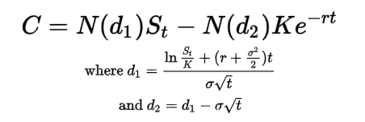

# **Black Scholes**
---
- determines price of European *option* contracts that can only be exercised at expiration 
- no dividends paid out during option's lifespan
- no transaction/commission costs included 
- returns on the underlying are normally distributed 

- requires 5 variables:
    - *K* = strike price
    - *S* = current stock price (spot price)
    - *t* = time to maturity
    - *r* = risk-free interest rate 
    - *σ* = volatility (sigma)
- *N* = CDF of normal distribution 
    - Cumulative Distribution Function of random variable *x*
    - `Fx(t) = P(x <= t)`
    - nondecreasing function of *t* for `-inf < t < inf`, but ranges from `0:1` since `Fx(t)` is a probability
        - max value of *x* is *b*, thus `Fx(b) = 1`
    - *x* is a discrete random variable whose minimum value is *a*
        - `Fx(a) = P(x<=a) = P(x=a = fx(a)` if `c < a` then `Fx(c) = 0`
- *C* = Call Option Price 

# **Greeks**
---
- Delta
- Gamma
- Theta
- Vega
- Rho

# **Level of Underlying**
---
- time to expiration of one year
- no time to expiration 
- time to expiration of three years 

  
    